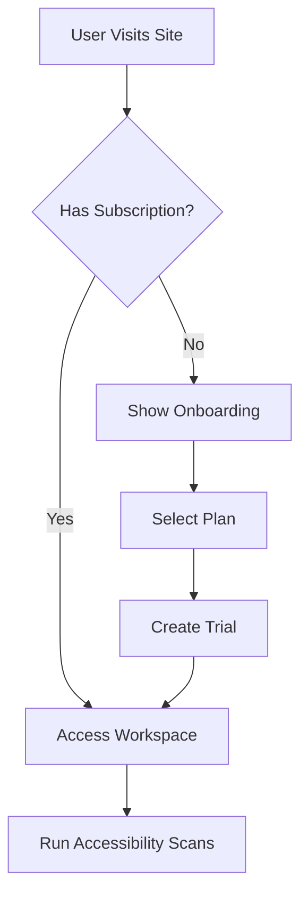
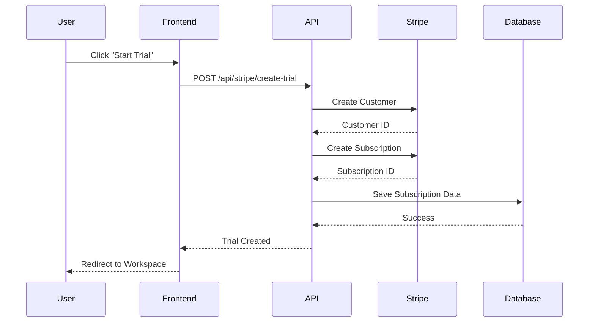
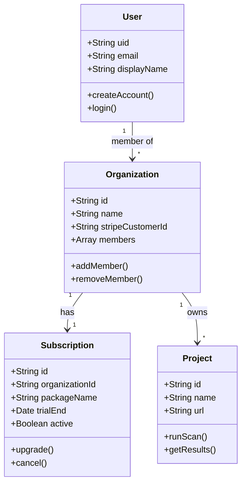
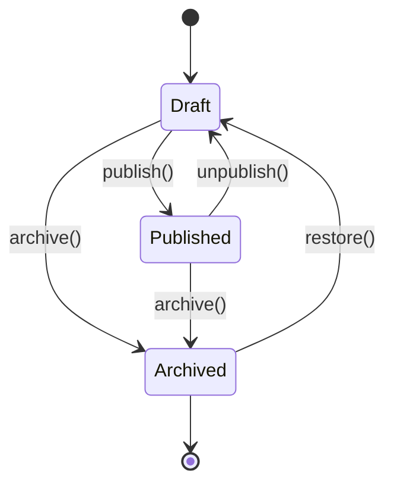
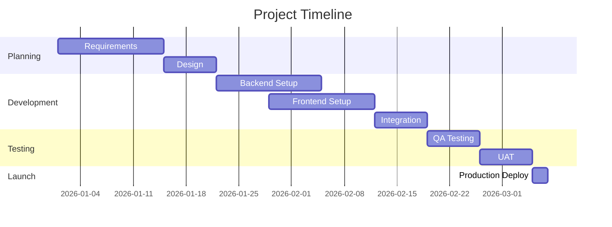
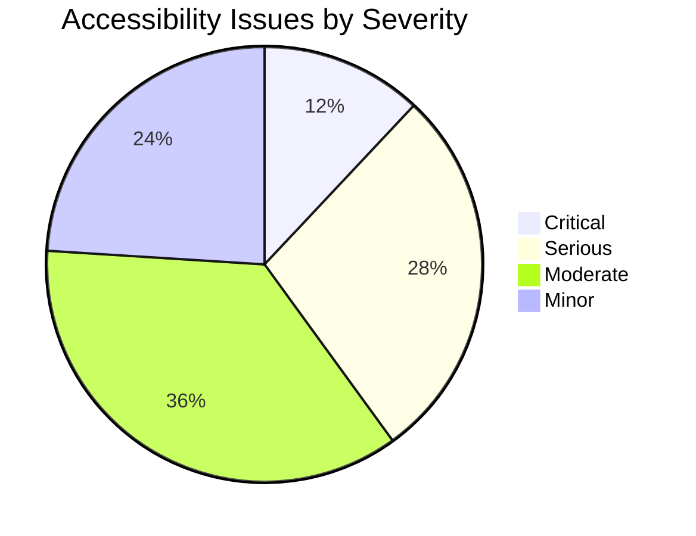
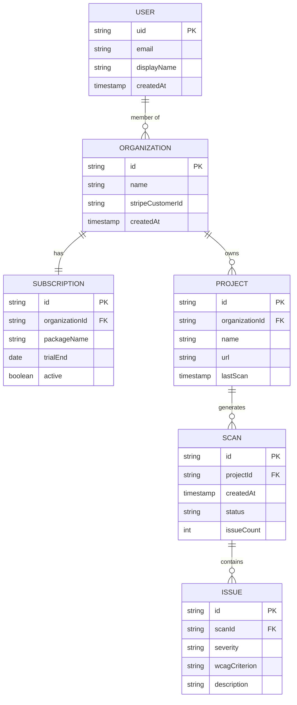
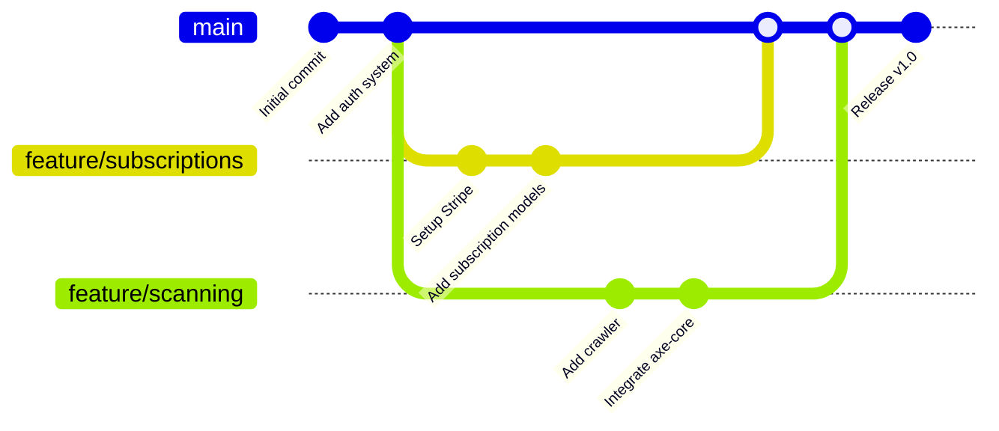

# Mermaid Diagram Examples

This document demonstrates the Mermaid diagram support in the dev docs viewer.

## Flowchart Example

## Sequence Diagram

## Class Diagram

## State Diagram

## Gantt Chart

## Pie Chart

## Entity Relationship Diagram

## Git Graph

## Usage

To add Mermaid diagrams to your documentation:

1. Create a code block with the language set to `mermaid`
2. Add your Mermaid diagram syntax inside the code block
3. The diagram will be automatically rendered when you view the document

Example:

\`\`\`mermaid
graph LR
    A[Start] --> B[Process]
    B --> C[End]
\`\`\`

For more Mermaid syntax and examples, visit: https://mermaid.js.org/
