# Subscription & Billing System

> Single source of truth for the Ablelytics subscription, billing, and payment system.
> Replaces the previous separate docs: `STRIPE_SETUP.md`, `STRIPE_QUICKSTART.md`, `STRIPE_INTEGRATION_SUMMARY.md`, `SUBSCRIPTION_SYSTEM.md`, `SUBSCRIPTION_FLOW_UPDATE.md`, `SUBSCRIPTION_IMPROVEMENTS.md`, `SUBSCRIPTION_CANCELLATION_GUIDE.md`, `SUBSCRIPTION_UPGRADE_DOWNGRADE_TEST_PLAN.md`.

---

## Table of Contents

1. [Architecture Overview](#1-architecture-overview)
2. [Pricing Tiers & Package Config](#2-pricing-tiers--package-config)
3. [Environment Variables](#3-environment-variables)
4. [Firestore Schema](#4-firestore-schema)
5. [API Routes](#5-api-routes)
6. [Webhook Handler](#6-webhook-handler)
7. [Subscription Lifecycle Flows](#7-subscription-lifecycle-flows)
   - [Registration & Trial](#71-registration--trial)
   - [Trial Extension](#72-trial-extension--7-days)
   - [Trial Conversion](#73-trial-to-paid-conversion)
   - [Inline Checkout (New Subscription)](#74-inline-checkout-new-subscription)
   - [Upgrade (Immediate)](#75-upgrade-immediate)
   - [Downgrade (Scheduled)](#76-downgrade-scheduled)
   - [Cancel Scheduled Downgrade](#77-cancel-scheduled-downgrade)
   - [Cancellation](#78-cancellation)
   - [Reactivation](#79-reactivation)
   - [Payment Failure & Recovery](#710-payment-failure--recovery)
   - [Usage Tracking & Period Rollover](#711-usage-tracking--period-rollover)
8. [UI Components](#8-ui-components)
9. [E2E Testing](#9-e2e-testing)
10. [Stripe Setup & Deployment](#10-stripe-setup--deployment)
11. [Security & Compliance](#11-security--compliance)
12. [Edge Cases & Gotchas](#12-edge-cases--gotchas)

---

## 1. Architecture Overview

```
                        Dashboard App (Next.js)
                       ┌──────────────────────────┐
                       │  Components / Pages       │
                       │  ├─ plan-selection        │
                       │  ├─ billing page          │
                       │  ├─ checkout-modal        │
                       │  └─ trial-status-banner   │
                       │           │                │
                       │  Services │                │
                       │  ├─ stripeService.ts       │
                       │  └─ subscriptionService.ts │
                       │           │                │
                       │  API Routes (server-side)  │
                       │  └─ /api/stripe/*          │
                       └───────────┬───────────────┘
                                   │
                    ┌──────────────┼──────────────┐
                    ▼              ▼               ▼
               Stripe API     Firestore     Firebase Auth
                    │                             │
                    │  Webhooks                   │
                    ▼                             │
          Firebase Cloud Functions               │
          └─ stripeWebhook handler ──────────────┘
                    │
                    ▼
               Firestore
          (subscriptions, paymentHistory, emailQueue)
```

**Stack**: Next.js (dashboard-app) + Firebase Cloud Functions + Firestore + Stripe.

All payment operations happen server-side (API routes or Cloud Functions). The client never touches Stripe secret keys. Card collection uses Stripe Elements (`@stripe/react-stripe-js`) for PCI compliance.

---

## 2. Pricing Tiers & Package Config

| Package | Monthly | Annual | Trial |
|---|---|---|---|
| **Basic** | $49 | $470/yr (save 20%) | 14-day free (no card) |
| **Starter** | $149 | $1,430/yr | -- |
| **Professional** | $399 | $3,830/yr | -- |
| **Enterprise** | Custom | Custom | -- |

### Package hierarchy (used for upgrade/downgrade detection)

```
basic (1) < starter (2) < professional (3)
```

Higher number = upgrade (immediate). Lower number = downgrade (scheduled at period end).

### Trial config

```typescript
TRIAL_CONFIG = {
  TRIAL_DAYS: 14,        // Initial trial length
  EXTENSION_DAYS: 7,     // Bonus when card is added
  MAX_TRIAL_DAYS: 21,    // 14 + 7
}
```

### Limits per tier

| Limit | Basic | Starter | Professional |
|---|---|---|---|
| Active Projects | 3 | 10 | Unlimited |
| Scans/month | 50 | 200 | 1,000 |
| Pages/scan | 100 | 500 | 2,000 |
| Scheduled Scans | 1 | 10 | Unlimited |
| Team Members | 1 | 5 | 20 |
| API Calls/day | -- | 500 | 5,000 |
| Report History | 30 days | 90 days | 365 days |

Configuration lives in `dashboard-app/app/config/subscriptions.ts` (`SUBSCRIPTION_PACKAGES`, `TRIAL_CONFIG`).

---

## 3. Environment Variables

### Dashboard app (`dashboard-app/.env.local`)

```bash
# Stripe keys
NEXT_PUBLIC_STRIPE_PUBLISHABLE_KEY=pk_test_...
STRIPE_SECRET_KEY=sk_test_...
STRIPE_WEBHOOK_SECRET=whsec_...

# App URL (used for Stripe success/cancel redirects)
NEXT_PUBLIC_APP_URL=http://localhost:3000

# Stripe Price IDs (one per plan + billing cycle)
NEXT_PUBLIC_STRIPE_BASIC_MONTHLY=price_...
NEXT_PUBLIC_STRIPE_BASIC_ANNUAL=price_...
NEXT_PUBLIC_STRIPE_STARTER_MONTHLY=price_...
NEXT_PUBLIC_STRIPE_STARTER_ANNUAL=price_...
NEXT_PUBLIC_STRIPE_PROFESSIONAL_MONTHLY=price_...
NEXT_PUBLIC_STRIPE_PROFESSIONAL_ANNUAL=price_...

# Firebase emulators (local dev only)
NEXT_PUBLIC_FIRESTORE_EMULATOR_HOST=localhost:8080
NEXT_PUBLIC_AUTH_EMULATOR_HOST=localhost:9099
```

### Firebase Functions

```bash
firebase functions:config:set stripe.secret_key="sk_test_..." stripe.webhook_secret="whsec_..."
```

> **Gotcha**: Do NOT put `FIRESTORE_EMULATOR_HOST` or `GCLOUD_PROJECT` in `functions/.env.local` -- the Functions emulator chokes on them. Export as shell env vars instead.

> **Gotcha**: Firebase Admin SDK doesn't read `NEXT_PUBLIC_*` vars. The file `firebase-admin.ts` bridges them: `NEXT_PUBLIC_FIRESTORE_EMULATOR_HOST` -> `FIRESTORE_EMULATOR_HOST`.

---

## 4. Firestore Schema

### `subscriptions/{userId}`

```typescript
{
  userId: string;
  organizationId: string;
  stripeCustomerId: string;
  stripeSubscriptionId: string;
  stripePriceId: string;

  packageId: string;          // 'basic' | 'starter' | 'professional'
  packageName: string;        // same as packageId
  status: string;             // 'trialing' | 'active' | 'past_due' | 'canceled' | 'expired'
  billingCycle: string;       // 'monthly' | 'annual'

  currentPeriodStart: Timestamp;
  currentPeriodEnd: Timestamp;

  // Trial fields
  trialStart: Timestamp | null;
  trialEnd: Timestamp | null;
  trialStartDate: Timestamp | null;   // legacy alias
  trialEndDate: Timestamp | null;     // legacy alias
  trialEndsAt: Timestamp | null;      // legacy alias
  trialExtended: boolean;
  trialExtendedAt: Timestamp | null;
  trialExtensionDays: number;
  hasPaymentMethod: boolean;
  convertedFromTrial: boolean;
  convertedAt: Timestamp | null;

  // Cancellation
  cancelAtPeriodEnd: boolean;
  cancelAt: Timestamp | null;
  canceledAt: Timestamp | null;

  // Scheduled downgrade
  scheduledChange?: {
    packageName: string;
    packageId: string;
    billingCycle: string;
    effectiveDate: Timestamp;
    scheduledAt: Timestamp;
  };

  // Usage tracking
  currentUsage: {
    activeProjects: number;
    scansThisMonth: number;
    apiCallsToday: number;
    scheduledScans: number;
    usagePeriodStart?: Timestamp;
  };
  usageHistory?: Array<{
    periodStart: Timestamp;
    periodEnd: Timestamp;
    usage: { ... };
    capturedAt: Date;           // NOT serverTimestamp (can't use inside arrayUnion)
    source: string;
  }>;

  createdAt: Timestamp;
  updatedAt: Timestamp;
}
```

### `organisations/{orgId}`

```typescript
{
  stripeCustomerId: string;     // Shared Stripe customer for the org
  // ... other org fields
}
```

### `paymentHistory/{paymentId}`

```typescript
{
  userId: string;
  stripeInvoiceId: string;
  amount: number;
  currency: string;
  status: 'succeeded' | 'failed';
  packageName: string;
  billingCycle: string;
  billingReason: string;
  createdAt: Timestamp;
}
```

---

## 5. API Routes

All routes live in `dashboard-app/app/api/stripe/`.

| Route | Method | Purpose |
|---|---|---|
| `create-trial` | POST | Create Stripe customer + subscription with 14-day trial (no card) |
| `extend-trial` | POST | Attach card, extend `trial_end` by 7 days |
| `convert-trial` | POST | Set `trial_end: 'now'` to start billing immediately |
| `inline-checkout` | POST | Full in-app checkout: attach card, create/upgrade subscription, business info, VAT |
| `create-checkout-session` | POST | Legacy: creates Stripe Checkout redirect session (still used as fallback) |
| `update-subscription` | POST | Change plan/price for existing paid subscribers |
| `cancel-subscription` | POST | Set `cancel_at_period_end: true` |
| `reactivate-subscription` | POST | Set `cancel_at_period_end: false` (undo cancel) |
| `cancel-scheduled-change` | POST | Revert Stripe metadata to current package (undo downgrade) |
| `create-portal-session` | POST | Stripe Customer Portal for self-service management |
| `payment-methods` | GET/POST/PATCH/DELETE | CRUD for saved payment methods |
| `invoices` | GET | List customer invoices |

---

## 6. Webhook Handler

Cloud Function `stripeWebhook` in `functions/handlers/stripeWebhook.js`.

### Events handled

| Event | Handler | What it does |
|---|---|---|
| `checkout.session.completed` | `handleCheckoutCompleted` | Creates/updates subscription doc from Checkout metadata |
| `customer.subscription.created` | `handleSubscriptionCreated` | Writes initial subscription doc with period dates and trial fields |
| `customer.subscription.updated` | `handleSubscriptionUpdated` | Core handler -- see detail below |
| `customer.subscription.deleted` | `handleSubscriptionDeleted` | Sets `status: 'canceled'`, clears schedule/cancel fields |
| `invoice.payment_succeeded` | `handleInvoicePaymentSucceeded` | Sets `status: 'active'`, records payment, detects trial conversion |
| `invoice.payment_failed` | `handleInvoicePaymentFailed` | Sets `status: 'past_due'`, increments retry count, queues email |
| `customer.subscription.trial_will_end` | -- | Queues trial-ending notifications |

### `handleSubscriptionUpdated` decision tree

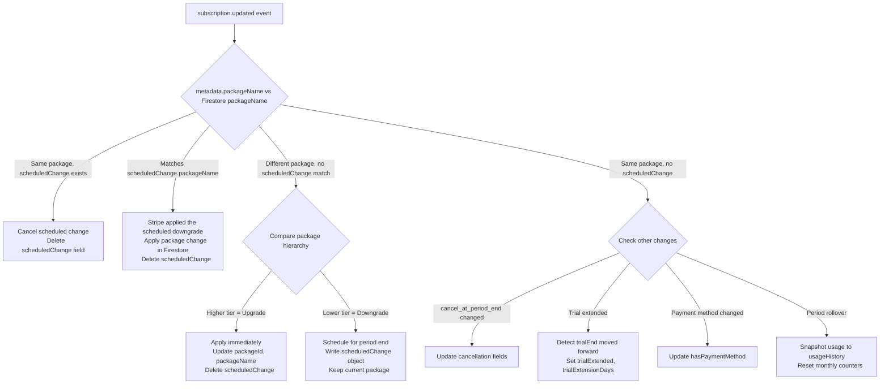

---

## 7. Subscription Lifecycle Flows

### 7.1 Registration & Trial

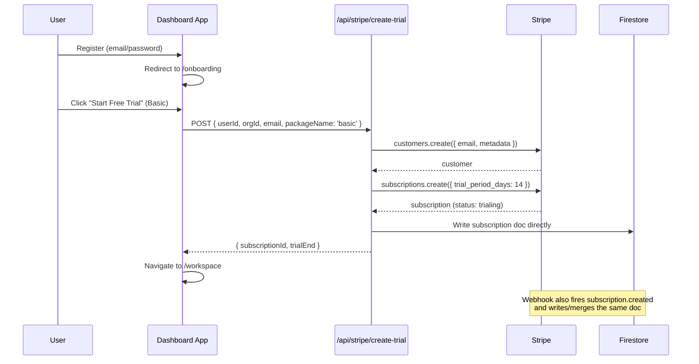

- 14-day free trial, no card required
- Stripe subscription created with `trial_settings.end_behavior.missing_payment_method: 'cancel'`
- Both the API route and the webhook write the subscription doc (race condition safe via `merge: true`)

### 7.2 Trial Extension (+7 days)

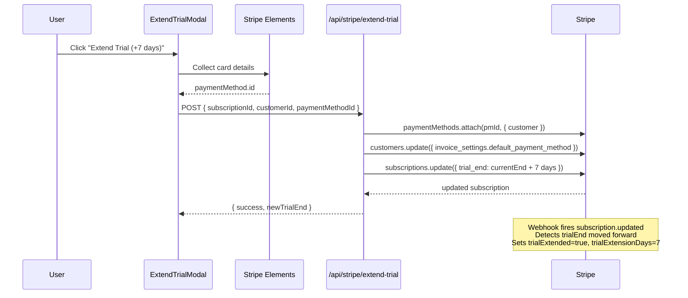

- Only available once (button hidden after extension)
- Card stays on file for when billing starts

### 7.3 Trial to Paid Conversion

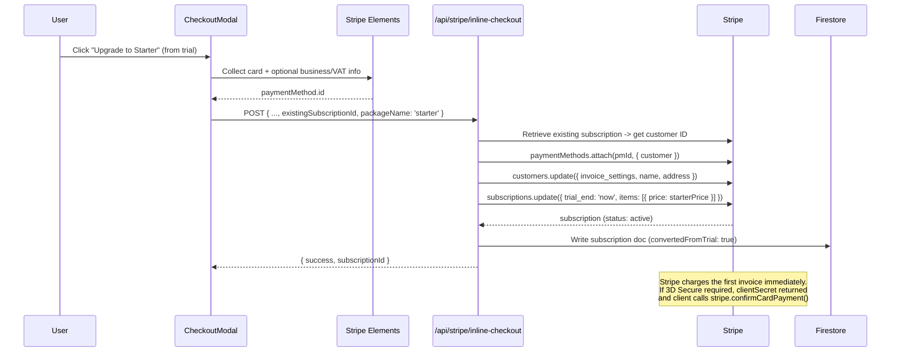

- Customer ID derived from the existing subscription (not the org doc) to avoid mismatches
- `default_payment_method` not passed on subscription update -- inherited from customer's `invoice_settings`

### 7.4 Inline Checkout (New Subscription)

Same flow as 7.3 but without `existingSubscriptionId`. Creates a new subscription.

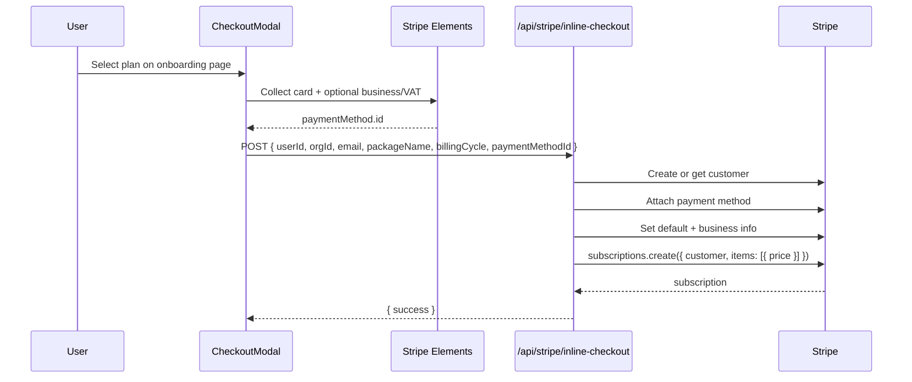

The checkout modal collects:
- Card details (Stripe Elements `CardElement`)
- Optional business info (company name, address) -- expandable section
- Optional VAT/Tax ID (EU VAT, GB VAT, US EIN, etc.)
- Handles 3D Secure/SCA inline via `stripe.confirmCardPayment()`

### 7.5 Upgrade (Immediate)

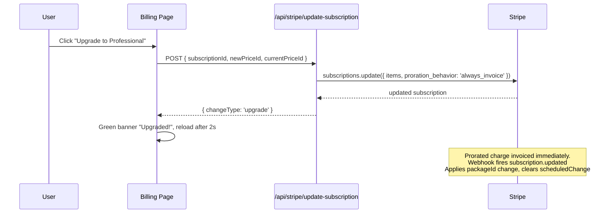

### 7.6 Downgrade (Scheduled)

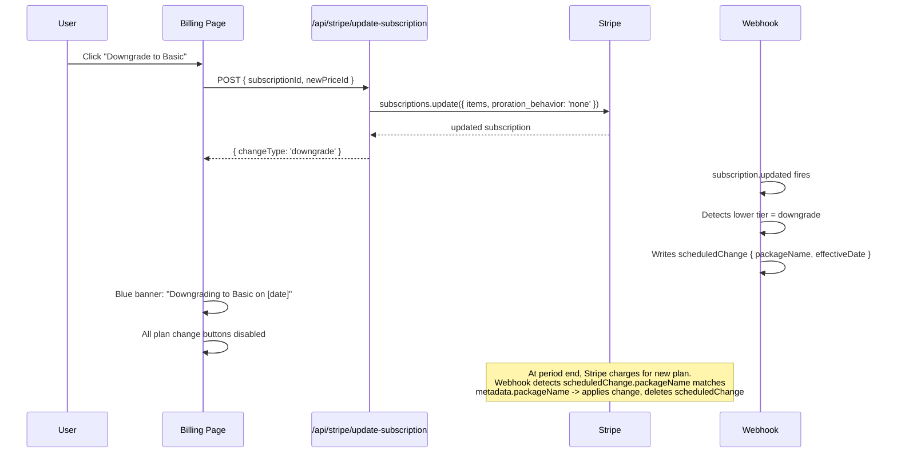

### 7.7 Cancel Scheduled Downgrade

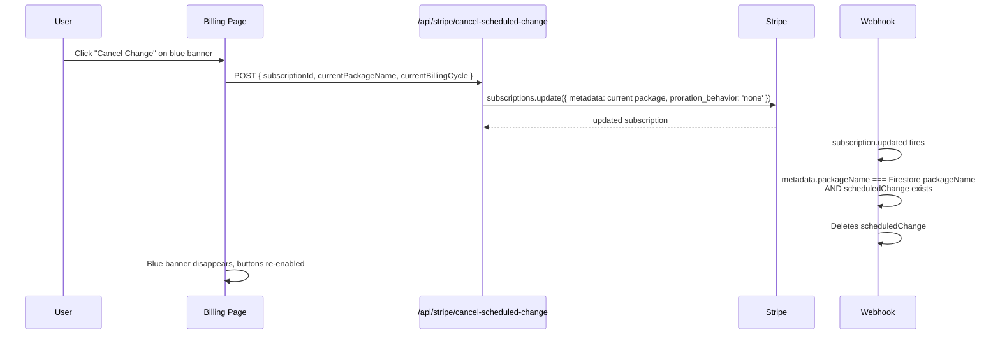

### 7.8 Cancellation

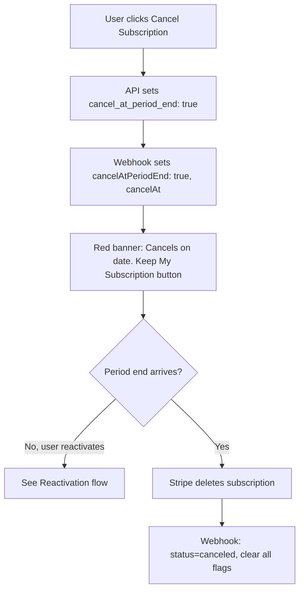

- Trial users can also cancel (same flow, message adapted)
- Cancel + scheduled downgrade can coexist; cancel banner takes priority in UI
- On actual cancellation, both `scheduledChange` and cancel flags are cleared

### 7.9 Reactivation

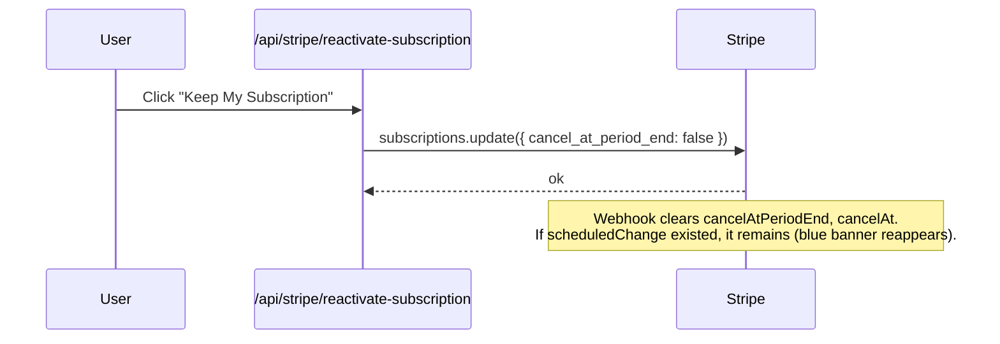

### 7.10 Payment Failure & Recovery

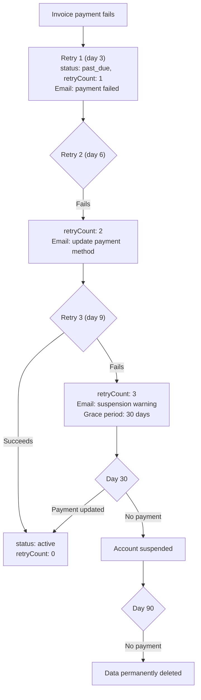

### 7.11 Usage Tracking & Period Rollover

On each `subscription.updated` webhook:
1. Compare `currentPeriodStart` old vs new
2. If new period started: snapshot `currentUsage` to `usageHistory` array, reset `scansThisMonth` and `apiCallsToday` to 0
3. `activeProjects` and `scheduledScans` carry over (not period-based)

> **Gotcha**: `FieldValue.serverTimestamp()` cannot be used inside `arrayUnion()`. The `capturedAt` field in usage snapshots uses `new Date()` instead.

---

## 8. UI Components

All subscription components in `dashboard-app/app/components/subscription/`.

| Component | Purpose |
|---|---|
| `checkout-modal.tsx` | In-app checkout with Stripe Elements. Card + business info + VAT. Handles 3D Secure. Used for new subscriptions and trial upgrades. |
| `extend-trial-modal.tsx` | Card collection for trial extension (+7 days). Uses Stripe Elements `CardElement`. |
| `trial-status-banner.tsx` | Shows trial days remaining with urgency colors (blue > yellow > red). Extend and Subscribe CTAs. |
| `plan-selection.tsx` | Onboarding plan picker. Trial for Basic, inline checkout for Starter/Professional. |
| `start-trial-button.tsx` | Creates Stripe-backed trial via `/api/stripe/create-trial`. |
| `update-subscription-button.tsx` | Plan change for paid subscribers. Green success notification with auto-dismiss. |
| `subscribe-button.tsx` | Legacy: redirects to Stripe Checkout. Kept as fallback. |
| `checkout-button.tsx` | Legacy: combined subscribe/update button. |
| `scheduled-change-banner.tsx` | Blue banner for pending downgrade. Shows date and "Cancel Change" button. |
| `cancel-scheduled-banner.tsx` | Red banner for pending cancellation. Shows date and "Keep My Subscription" button. |
| `payment-methods.tsx` | CRUD for saved cards: list, add, set default, remove. |

### Shared component: `price-col.tsx` (`components/atom/`)

Renders a plan card on the billing page. Decides which action to show:

```
if (isCurrentPlan)           -> "Current Plan" (disabled)
if (trial, no card)          -> fires onCheckout() -> opens CheckoutModal
if (has subscription + card) -> UpdateSubscriptionButton (direct API call)
```

### UI Banner Priority

```
canceled         -> "No active subscription"
cancelAtPeriodEnd -> Red cancel banner (hides downgrade banner, hides cancel button)
scheduledChange   -> Blue downgrade banner (disables plan change buttons)
normal            -> Current plan + upgrade/downgrade options
```

### Private Route (`utils/private-router.tsx`)

- Checks Firestore for active subscription
- Redirects to `/onboarding` if no subscription found
- Redirects to `/workspace/billing?trial_expired=true` if trial has expired
- Handles both `'trial'` and `'trialing'` statuses
- Graceful error handling: allows access on failure to prevent lockout

---

## 9. E2E Testing

### Scripts

| Script | Location | Mode |
|---|---|---|
| Firestore-only scenarios | `functions/scripts/subscription-scenarios.js` | `npm run scenarios:subscriptions` |
| Real Stripe E2E | `functions/scripts/stripe-subscription-e2e.js` | `npm run scenarios:subscriptions:e2e` |

### E2E Test Scenarios

| # | Scenario | Actions | Final State |
|---|---|---|---|
| 1 | `trial_user_canceled` | Create trial, cancel | `status: canceled` |
| 2 | `trial_user_expired` | Create trial, let expire | `status: expired`, email queued |
| 3 | `trial_user_extended_canceled` | Create trial, extend +7d, cancel | `trialExtended: true`, `status: canceled` |
| 4 | `trial_user_extended_paying` | Create trial, extend, convert | `status: active`, `convertedFromTrial: true` |
| 5 | `trial_user_auto_converted` | Create trial, extend, advance clock 22d | Auto-charged, `convertedFromTrial: true` |
| 6 | `paying_user_upgrade` | Starter -> Professional | `packageId: professional` |
| 7 | `paying_user_downgrade` | Professional -> Starter (scheduled) | `scheduledChange.packageId: starter` |
| 8 | `paying_user_cancel_subscription` | Active -> cancel -> period end | `status: canceled` |
| 9 | `limits_current_period_usage_populated` | Populate usage counters | Usage fields present |
| 10 | `limits_enforced_projects_scans` | At limits, try to exceed | Operations blocked |
| 11 | `payment_failed_notified_dashboard_email` | Payment fails | `status: past_due`, email queued |

### Running E2E tests

```bash
# Prerequisites
firebase emulators:start
stripe listen --forward-to http://localhost:5001/{project}/us-central1/stripeWebhook

# Run all scenarios
npm run scenarios:subscriptions:e2e:all

# Interactive mode
npm run scenarios:subscriptions:e2e
```

### E2E features
- Stripe test clocks for time simulation
- Webhook replay: fetches real Stripe events and posts to local webhook
- Field-level Firestore diff after each action
- Identity seeding in emulator (Auth user + Firestore docs)
- Safety: blocks production Firestore and live Stripe keys by default

---

## 10. Stripe Setup & Deployment

### Local development

1. Install Stripe CLI: `brew install stripe/stripe-cli/stripe`
2. Login: `stripe login`
3. Create products & prices in Stripe Dashboard (test mode):
   - Basic Monthly, Basic Annual
   - Starter Monthly, Starter Annual
   - Professional Monthly, Professional Annual
4. Copy price IDs to `.env.local`
5. Forward webhooks:
   ```bash
   stripe listen --forward-to http://localhost:5001/accessibilitychecker-c6585/us-central1/stripeWebhook
   ```
6. Copy the webhook signing secret (`whsec_...`) to `.env.local`

### Test cards

| Scenario | Card Number |
|---|---|
| Success | `4242 4242 4242 4242` |
| Declined | `4000 0000 0000 0002` |
| Insufficient Funds | `4000 0000 0000 9995` |
| 3D Secure Required | `4000 0025 0000 3155` |

Use any future expiry, any 3-digit CVC, any 5-digit ZIP.

### Webhook events to subscribe to

```
checkout.session.completed
customer.subscription.created
customer.subscription.updated
customer.subscription.deleted
invoice.payment_succeeded
invoice.payment_failed
customer.subscription.trial_will_end
```

### Production deployment

1. Switch to live Stripe API keys
2. Recreate products/prices in live mode
3. Update webhook endpoint: `https://us-central1-{project}.cloudfunctions.net/stripeWebhook`
4. Use live webhook signing secret
5. Enable Stripe Radar for fraud prevention
6. Deploy: `firebase deploy --only functions:stripeWebhook`

---

## 11. Security & Compliance

- **PCI DSS**: Card details never touch our servers. Stripe Elements handles all card input.
- **Webhook verification**: All webhook payloads verified via `stripe.webhooks.constructEvent()` with signing secret.
- **Server-side only**: Stripe secret key used only in API routes and Cloud Functions, never exposed to client.
- **Firestore rules**:
  ```javascript
  match /subscriptions/{userId} {
    allow read: if request.auth.uid == userId;
    allow write: if false; // Only Cloud Functions can write
  }
  ```
- **Idempotent writes**: All webhook handlers use `set(..., { merge: true })` to handle duplicate events.

---

## 12. Edge Cases & Gotchas

| Issue | Detail |
|---|---|
| **Webhook race condition** | API routes write subscription docs directly AND the webhook writes them. Both use `merge: true` so whichever arrives second just merges. |
| **Newer Stripe API versions** | `current_period_start/end` moved from subscription root to `items.data[0]`. Webhook falls back to item-level fields. |
| **`NEXT_PUBLIC_*` env vars** | Firebase Admin SDK doesn't read these. `firebase-admin.ts` bridges them to standard names. |
| **`serverTimestamp()` in `arrayUnion()`** | Firestore doesn't allow `FieldValue.serverTimestamp()` inside arrays. Use `new Date()` instead. |
| **Scheduled downgrade never applied** | When Stripe executes a scheduled downgrade, the webhook sees `metadata.packageName !== Firestore.packageName` and would schedule it again. Fixed by checking if `metadata.packageName === scheduledChange.packageName` first. |
| **Payment method not attached** | For trial upgrades, customer ID must come from the existing subscription (not org doc) to ensure the payment method attaches to the right customer. |
| **`customer_update` without `customer`** | Stripe Checkout's `customer_update` param requires an existing `customer` ID. Don't include it when using `customer_email`. |
| **Trial status strings** | Stripe uses `'trialing'`, legacy Firestore docs may have `'trial'`. Both are handled everywhere. |
| **Stale `scheduledChange` blocking buttons** | If webhook fails, `scheduledChange` may linger. Cancel-and-redo or manual Firestore cleanup required. |
| **Cancel + downgrade coexistence** | Both can exist simultaneously. Cancel banner takes priority in UI. Both cleared when subscription actually ends. |
